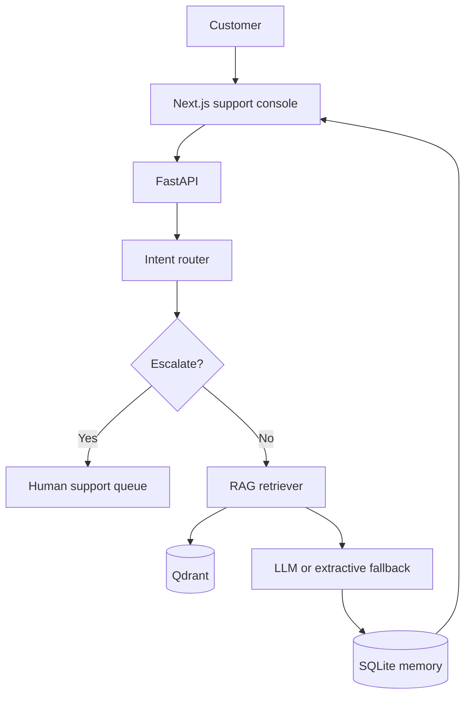

# AI Customer Support Assistant

A full-stack customer-support assistant that routes requests by intent, retrieves grounded answers from a Qdrant knowledge base, cites its sources, remembers conversations, and escalates sensitive or low-confidence cases to a human agent.

## Highlights

- Intent routing for billing, technical support, account access, product questions, complaints, and general requests
- Retrieval-Augmented Generation using sentence-transformer embeddings and Qdrant
- Source citations tied to knowledge-base documents
- Persistent multi-turn sessions stored in SQLite
- Human escalation for explicit requests, safety-sensitive language, repeated failures, and low-confidence retrieval
- Groq, Gemini, and Mistral generation with a safe extractive fallback
- Next.js agent-style support console
- Docker Compose and GitHub Actions CI

## Architecture



## Project Structure

```text
├── backend/
│   ├── app/
│   │   ├── main.py
│   │   ├── config.py
│   │   ├── database.py
│   │   ├── intent.py
│   │   ├── knowledge.py
│   │   ├── service.py
│   │   └── schemas.py
│   ├── tests/
│   └── Dockerfile
├── frontend/
│   ├── app/
│   └── Dockerfile
├── knowledge-base/
│   └── starter-faq.md
├── .github/workflows/ci.yml
└── docker-compose.yml
```

## Quick Start

1. Create the backend environment file:

   ```bash
   cp backend/.env.example backend/.env
   ```

2. Start the stack:

   ```bash
   docker compose up --build
   ```

3. Open:

   - Support console: http://localhost:3000
   - API documentation: http://localhost:8000/docs
   - Qdrant dashboard: http://localhost:6333/dashboard

The backend automatically indexes `knowledge-base/starter-faq.md` on first startup. The application works without an LLM key by returning the strongest retrieved passage. Add a provider key for synthesized responses.

## API

| Method | Endpoint | Purpose |
|---|---|---|
| `GET` | `/health` | Application health |
| `POST` | `/api/chat` | Route, retrieve, answer, remember, or escalate |
| `GET` | `/api/sessions/{session_id}` | Conversation history |
| `POST` | `/api/knowledge` | Upload PDF, DOCX, Markdown, or TXT content |
| `GET` | `/api/escalations` | List open human-support cases |
| `PATCH` | `/api/escalations/{case_id}` | Update escalation status |

## Escalation Policy

A conversation is escalated when:

- the customer explicitly asks for a human;
- the message contains urgent safety, fraud, legal, or account-compromise language;
- retrieval confidence is below the configured threshold; or
- the session has accumulated two unresolved assistant responses.

## Environment Variables

| Variable | Default |
|---|---|
| `QDRANT_URL` | `http://qdrant:6333` |
| `COLLECTION_NAME` | `support_knowledge` |
| `DATABASE_PATH` | `/data/support.db` |
| `LLM_PROVIDER` | `extractive` |
| `GROQ_API_KEY` | empty |
| `GOOGLE_API_KEY` | empty |
| `MISTRAL_API_KEY` | empty |
| `ESCALATION_THRESHOLD` | `0.35` |
| `CORS_ORIGINS` | `http://localhost:3000` |

## Production Improvements

- Replace SQLite with PostgreSQL and add tenant isolation
- Add OAuth, RBAC, rate limiting, and audit logs
- Integrate escalation records with Zendesk, Salesforce, or ServiceNow
- Add hybrid retrieval, reranking, and offline RAG evaluation
- Add PII redaction and configurable data-retention policies

## License

MIT
